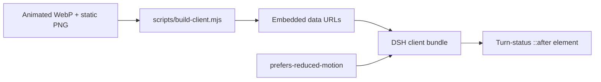

<p align="center">
  
</p>

<p align="center">
  <a href="https://awesome.re"></a>
  <a href="https://awesome-dsh-plugin.com"></a>
  <a href="LICENSE"></a>
  
  
  
</p>

<p align="center">
  <strong>A persistent black whale-dive animation beside the DeepSeek Harness turn status.</strong><br />
  Closed-loop playback, no runtime network requests, and a static fallback for reduced-motion users.
</p>

<p align="center">
  English · <a href="README.zh-CN.md">简体中文</a>
</p>

## Preview

<p align="center">
  
</p>

> The preview uses every second frame to keep the repository page lightweight. The plugin ships the full **618-frame** lossless animation.

## Screenshots

<table>
  <tr>
    <td width="33%"></td>
    <td width="33%"></td>
    <td width="33%"></td>
  </tr>
  <tr>
    <td align="center"><strong>01 — Breach</strong></td>
    <td align="center"><strong>02 — Apex</strong></td>
    <td align="center"><strong>03 — Deep dive</strong></td>
  </tr>
</table>

Each screenshot is rendered from the committed `assets/whale-dive.webp`, so the gallery represents the frames users actually receive—not separate concept art.

## Highlights

| | Feature | What it means |
|---|---|---|
| 🌊 | **Seamless closed loop** | A forward/return trajectory avoids the visible final-frame-to-first-frame snap. |
| 🐋 | **Recognizable black whale** | A monochrome whale silhouette stays legible beside the compact turn-status label. |
| 📦 | **Self-contained bundle** | Animated WebP and PNG fallback are embedded in the built client; no runtime URL or source-frame directory is required. |
| ♿ | **Reduced-motion aware** | `prefers-reduced-motion` switches the animation to the included static PNG. |
| 🔌 | **Persistent DSH plugin** | The `dsh.bundle` manifest and `cordis.patch.yml` mount the client automatically in the Web profile. |

## Install

Install directly from GitHub into the DSH Web profile:

```powershell
dsh plugin --profile web add github:LeemanCheung/dsh-whale-animation
```

Then hard-refresh the DSH Web page. Restart DSH if the running profile has already cached its client bundle.

### Uninstall

```powershell
dsh plugin --profile web remove dsh-whale-animation
```

## Animation profile

| Property | Value |
|---|---:|
| Canvas | 184 × 184 px |
| Source frames | 618 |
| Frame duration | 17 ms |
| Loop duration | 10.506 s |
| Encoding | Lossless animated WebP with alpha |
| Reduced-motion asset | Transparent PNG |
| Runtime asset requests | None |

The final encoded WebP is decoded during validation—not merely checked at the source-frame level. The current closed-loop seam has an alpha-difference score of `0.01858`, and its 17 ms cadence produces no skipped source frames under the project’s 60 Hz sampling check.

## How it works



The client adds a package-owned stylesheet to the DSH turn-status element. Both assets are embedded as data URLs in `lib/client.js`, so activation does not depend on the repository checkout after installation.

## Development

Requirements: **Node.js 20+**. Python and Pillow are needed only when rebuilding the README artwork.

```powershell
node scripts/build-client.mjs
node scripts/check.mjs
python scripts/build-readme-assets.py
python scripts/check-readme-assets.py
```

### Repository layout

```text
assets/
  whale-dive.webp        Full lossless animation
  whale-static.png       Reduced-motion fallback
docs/
  hero.png               README hero artwork
  preview.webp           Lightweight animated README preview
  screenshots/           Breach, apex, and deep-dive frame gallery
lib/
  client.js              Prebuilt DSH browser client
scripts/
  build-client.mjs       Embeds source assets into the client
  build-readme-assets.py Rebuilds repository artwork from the real animation
  check-readme-assets.py Validates artwork timing, size, and README links
  check.mjs              Validates registration, lifecycle, and embedded assets
cordis.patch.yml         Persistent DSH bundle composition patch
```

`lib/client.js` is committed intentionally: GitHub installs work without a package build or external asset fetch.

## Compatibility

- Targets the **DeepSeek Harness Web UI**.
- Requires a DSH version compatible with `@deepseek-ai/dsh-client-runtime ^0.1.0-rc.6`.
- Relies on the current turn-status CSS class pattern; a future DSH shell redesign may require a selector update.

## Attribution

This project is independent and is not affiliated with or endorsed by DeepSeek. The animation is an original UI illustration designed to harmonize with DeepSeek Harness' whale-themed status experience. See [NOTICE.md](NOTICE.md) for visual-design and trademark details.

## License

Released under the [MIT License](LICENSE).
