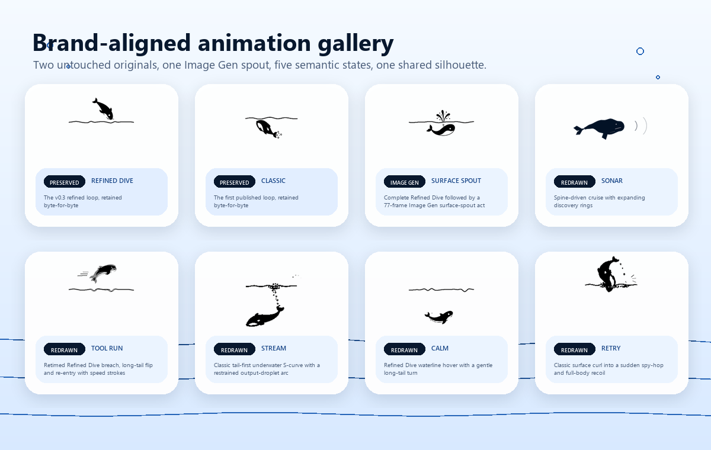
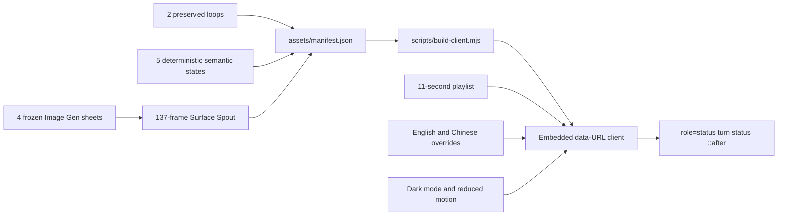
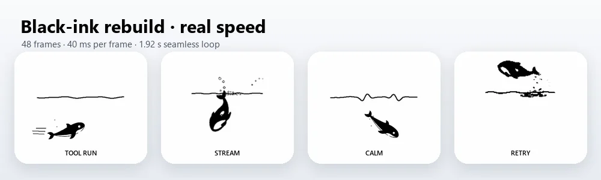
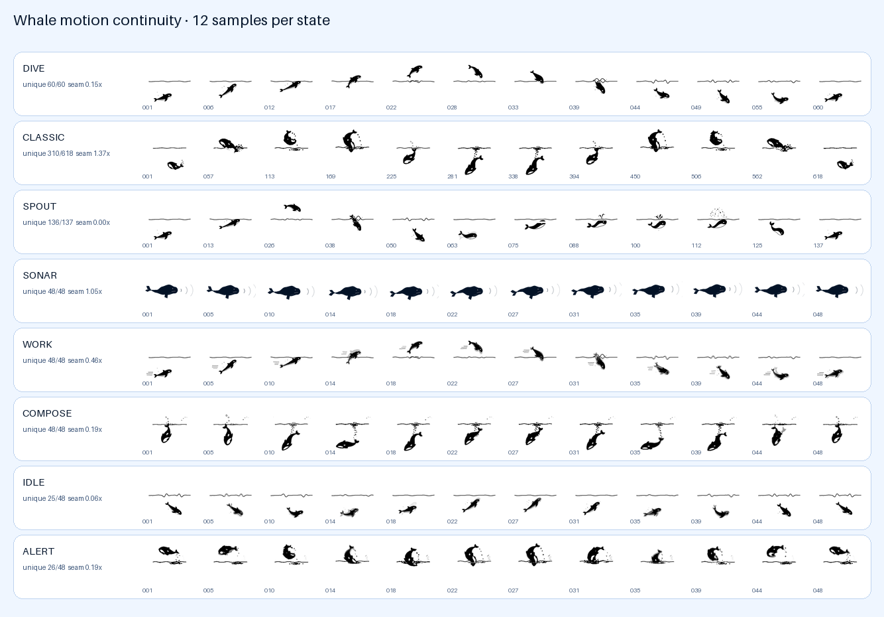
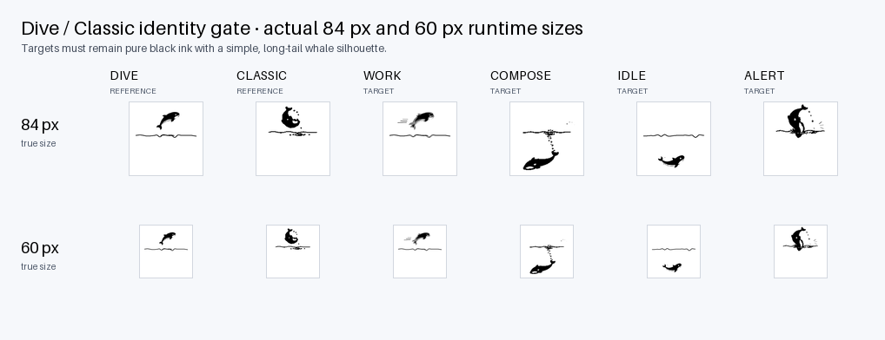

<p align="center">
  
</p>

<p align="center">
  <a href="https://awesome.re"></a>
  <a href="https://awesome-dsh-plugin.com"></a>
  <a href="LICENSE"></a>
  
  
  
  
</p>

<p align="center">
  <strong>Two original whale loops remain byte-for-byte intact; a 64-cel Image Gen surface spout now joins the five semantic states.</strong><br />
  Timed rotation, keyword overrides, dark-theme support, zero runtime requests, and a static fallback for every state.
</p>

<p align="center">
  English · <a href="README.zh-CN.md">简体中文</a>
</p>

## Preview

<p align="center">
  
</p>

v0.6.0 preserves the v0.5 visual correction and adds **Surface Spout** as a separate state. Its runtime WebP is the complete 137-frame seamless cycle: the untouched 60-frame Refined Dive followed by a 77-frame spout segment assembled from four frozen 4×4 Image Gen sheets. The existing Sonar, Work, Stream, Calm, and Retry assets remain unchanged.

The two pre-v0.4 loops remain intact:

- **Refined Dive** is restored directly from commit `65e1205d1fbf4b01997e6dfc099103b0f9717e37` and remains the default state.
- **Classic** is restored directly from the first published commit `95b06e3f0e6ea817d25858eb29f7064a233b3c65`.

CI recomputes the Git blob SHA-1 for those four legacy files and fails if even one byte changes.

## Eight states

<p align="center">
  
</p>

| State | Source | Motion language | Trigger logic |
|---|---|---|---|
| **Refined Dive** | Preserved | The v0.3 refined breach-and-dive loop, unchanged | Default; playlist; thinking, reasoning, analysis, planning |
| **Classic** | Preserved | The first published whale loop, unchanged | Playlist; explicit classic/original keywords |
| **Surface Spout** | Image Gen | Complete Dive followed by a 77-frame articulated surface-spout act | Playlist; spout, surface, blowhole, 喷水, 浮面, 换气 |
| **Sonar** | Redrawn | Slow spine-driven cruise with expanding discovery rings | Playlist; search, browse, lookup, research |
| **Tool Run** | Redrawn | Pure-black surge, full-body travelling wave, ink speed strokes | Playlist; tool, execute, shell, build, test |
| **Stream** | Redrawn | Upward black-ink sweep with a restrained droplet arc | Playlist; writing, generating, responding, streaming |
| **Calm** | Redrawn | Under-waterline hover, long-tail drift, bubbles, restrained blink | Playlist; waiting, queued, paused |
| **Retry** | Redrawn | Compact black-ink C-curve recoil and three attention strokes | Error, failure, exception, retry keywords only |

English and Chinese keywords are included. The ordinary `Deep diving...` label deliberately remains neutral, allowing the current Harness UI to rotate through `dive → classic → spout → sonar → work → compose → idle` every **11 seconds**. The slot is long enough for the 10.506-second preserved Classic loop and the 4.521-second spout cycle to finish. Recognizable status text overrides the playlist immediately.

## Visual design contract

Work, Stream, Calm, and Retry are generated from the real Dive/Classic frame masks rather than a replacement logo body. Sonar keeps its existing generated treatment. The four rebuilt states enforce:

- pure black/white visible pixels on a genuinely transparent RGBA canvas, with no blue artwork;
- no dorsal fin or shark-like profile;
- the exact compact head, tapered torso, long curved tail stock, broad flukes, and negative-space details already present in the preserved frames;
- real whole-body breach, flip, dive, hover, S-curve, spy-hop, splash, and recoil poses instead of moving a horizontal capsule;
- cosine retiming for forward/reverse subsequences so reversal velocity reaches zero without a hard cut;
- state effects kept secondary to the silhouette.

The preserved states are not regenerated or visually normalized. Their exact original files remain available in the runtime playlist and release package.

## Highlights

| | Feature | What it means |
|---|---|---|
| 🐋 | **Two originals preserved** | Historical WebP and PNG blobs are restored under stable asset paths and verified byte-for-byte in CI. |
| 🌊 | **Four legacy-silhouette rebuilds** | Tool Run and Calm derive from Dive; Stream and Retry derive from Classic. Sonar remains intact. |
| 💦 | **Auditable Image Gen spout** | Four frozen source sheets contribute 64 native poses; six sheet bridges and seven handoff frames produce a 77-frame act inside the 137-frame cycle. |
| 🎬 | **Dual-track animation director** | The current fixed label uses timed rotation; future or customized status labels use immediate keyword overrides. |
| ♿ | **Per-state reduced motion** | `prefers-reduced-motion` freezes rotation and uses the matching PNG frame. |
| 🌗 | **Theme and viewport aware** | System dark mode, `html.dark`, and `data-theme="dark"` invert the monochrome artwork; sizing steps down through 84 / 72 / 60 px. |
| 📦 | **Completely self-contained** | All WebPs and PNGs are embedded in `lib/client.js`; activation makes no external request. |
| 🧩 | **Resilient mount selector** | Combines semantic `role="status"` targeting with the `_turnStatus` class fallback. |
| 🫧 | **Low style intrusion** | Owns only the status element's `::after`; it does not alter the status label or clear `::before`. |
| ♻️ | **Lifecycle-clean** | Re-activation removes stale ownership; disposal removes styles, timer, observer, listeners, and data attributes. |
| 🔒 | **Strictly visual scope** | No accounts, tools, storage, workspace reads, networking, or user-content processing. |

## Install

Install the v0.6.0 release into the DSH Web profile:

```powershell
dsh plugin --profile web add github:LeemanCheung/dsh-whale-animation#v0.6.0
```

Follow the main branch:

```powershell
dsh plugin --profile web add github:LeemanCheung/dsh-whale-animation
```

Hard-refresh DSH Web after installation. Restart DSH if the active profile has already cached its client bundle.

### Upgrade

```powershell
dsh plugin --profile web remove dsh-whale-animation
dsh plugin --profile web add github:LeemanCheung/dsh-whale-animation#v0.6.0
```

### Uninstall

```powershell
dsh plugin --profile web remove dsh-whale-animation
```

## Animation profile

| Property | Value |
|---|---:|
| Total states | 8 |
| Preserved legacy states | 2 |
| Redrawn generated states | 5 |
| Image Gen states | 1 |
| Automatic playlist states | 7 |
| Surface Spout runtime | 137 × 33 ms = 4.521 s; Dive 60 + spout 77 |
| Generated-state canvas | 352 × 352 px |
| Preserved native canvases | Refined Dive 352 × 352; Classic 184 × 184 |
| Generated-state cadence | 48 frames × 40 ms |
| Generated-state loop | 1.920 s |
| Legacy cadence | Retained from the original files |
| Playlist interval | 11 seconds |
| CSS display sizes | 84 / 72 / 60 px |
| Runtime asset requests | 0 |

## How it works



`lib/index.js` remains an intentional no-op Host entry. All behavior runs in the browser through `dsh.client`. A `MutationObserver` handles Harness subtree replacement, while a one-second timer performs state selection; animated-WebP decoding remains browser-native.

The target selector is:

```css
.Md3f7G_turnStatus[role="status"],
[class*="_turnStatus"][role="status"]
```

The client writes `data-dsh-whale-host` and `data-dsh-whale-state` to the status element, and CSS paints the selected asset through `::after`. Reduced-motion mode selects the corresponding PNG and stays on the default or explicit keyword state instead of rotating.

## Development and verification

Requirements: **Node.js 20+**, Python 3, and Pillow:

```powershell
python -m pip install -r requirements.txt
npm run verify
npm run check:browser
```

| Command | Purpose |
|---|---|
| `npm run build:spout` | Rebuild the 137-frame Surface Spout and provenance from four frozen source sheets |
| `npm run build:assets` | Keep both legacy assets untouched; rebuild the spout, five semantic states, manifest, hero, preview, and gallery |
| `npm run build:runtime-assets` | Rebuild only runtime animation assets and manifest; CI-safe with no system-font rendering |
| `npm run build` | Embed every manifest asset into `lib/client.js` |
| `npm run build:motion-audit` | Write the deterministic 12-sample contact sheet and motion evidence report |
| `npm run build:style-audit` | Write the true-size 84/60 px Dive/Classic identity comparison and palette evidence |
| `npm run audit:motion` | Recompute visible-frame diversity and continuity, then reject stale or failing evidence |
| `npm run audit:style` | Reject blue/chromatic pixels, opaque backgrounds, complex interior detail, and illegible silhouettes |
| `npm run check` | Validate preserved Git blobs, generated timing, bundle, director logic, lifecycle, and README artwork |
| `npm run check:browser` | Mount all eight resolved states in headless Chromium and capture light/dark screenshots |
| `npm run verify` | Rebuild assets and client, then run the deterministic non-browser suite |

Checks cover:

- exact Git blob SHA-1 for both historical WebPs and both historical PNGs;
- 48 frames, 40 ms cadence, and 1.92-second loops for every redrawn state;
- true RGBA transparency, pure-black visible pixels, simple interior detail, and 60/84 px silhouette legibility for the four rebuilt states;
- file sizes, SHA-256 digests, manifest metadata, and embedded data-URL agreement;
- timed rotation through both preserved states and all ordinary redrawn states;
- English/Chinese keyword overrides, error priority, and reduced-motion freezing;
- style installation, `MutationObserver`, timer disposal, and host-attribute cleanup;
- hero, preview, gallery dimensions and local documentation links;
- Chromium state mapping, light/dark captures, and `npm pack --dry-run` in CI.

### Motion continuity evidence

<p align="center">
  
</p>

The four rebuilt states above play at the exact runtime cadence: 48 frames × 40 ms, a 1.92-second seamless loop. It is separate from the accelerated multi-state README playlist preview. [`docs/rebuilt-states-real-speed.json`](docs/rebuilt-states-real-speed.json) locks the preview SHA-256 and the four source animation hashes so CI rejects stale artwork.

<p align="center">
  
</p>

[`docs/motion-audit.json`](docs/motion-audit.json) records visible-frame diversity after alpha normalization, frozen-step ratio, absolute and foreground-normalized change, moving-foreground coverage, both alpha-shape and premultiplied-RGBA appearance centroids, sampled-frame hashes, and the loop seam. Ordinary generated artwork keeps a 4 px centroid cap. The four explicitly `derivedFrom` states retain the original loops' intentional whole-body travel and therefore use a separately reported 24 px cap while keeping the same step-ratio, absolute-change, foreground-change, coverage, and seam gates. Calm and Retry intentionally retrace their pose sequence (25/48 and 26/48 unique visible frames), but both have a zero frozen-adjacent-frame ratio, 0.67–0.68 median moving-foreground coverage, and loop seams below 0.20× the ordinary step.

### 60/84 px identity evidence

<p align="center">
  
</p>

[`docs/style-identity-audit.json`](docs/style-identity-audit.json) checks every animated and reduced-motion frame pair for true transparency, zero blue/chromatic visible pixels, limited light interior detail, matching static-frame mapping, and a substantial connected whale silhouette at both sizes. The contact sheet renders the actual runtime sizes rather than enlarged crops. Image-generation pose studies and rejected directions are recorded in [`docs/animation-lineage.json`](docs/animation-lineage.json); provider RGB white-ground studies are action inspiration only and never the accepted body identity.

The design rationale and future roadmap are documented in [`docs/ANIMATION_ROADMAP.zh-CN.md`](docs/ANIMATION_ROADMAP.zh-CN.md).

## Repository layout

```text
assets/
  whale-dive.webp/.png      Preserved refined loop from v0.3
  whale-classic.webp/.png   Preserved first published loop
  whale-spout.webp/.png     137-frame Image Gen spout cycle and static representative
  whale-sonar.webp/.png     Redrawn generated state
  whale-work.webp/.png      Redrawn generated state
  whale-compose.webp/.png   Redrawn generated state
  whale-idle.webp/.png      Redrawn generated state
  whale-alert.webp/.png     Redrawn generated state
  whale-static.png          Compatibility alias for pre-v0.4 consumers
  manifest.json             Source, timing, sizes, commits, and SHA-256 checksums
artwork-sources/spout-imagegen-v1/
  phase-*.png               Four frozen 4×4 source sheets; excluded from npm runtime
  prompts.md                Exact source-generation brief
  native-contact.png        77-frame segment contact sheet
  build-report.json         Sheet hashes, frame mapping, and motion provenance
src/
  client-runtime.js         Director and browser lifecycle source
lib/
  index.js                  No-op Host entry
  client.js                 Prebuilt DSH Web client with embedded assets
scripts/
  build-whale-spout.py      Deterministic 64-cel spout assembler and provenance gate
  whale_assets/model.py     Sonar model plus shared image/build primitives
  whale_assets/states.py    Preserved metadata and legacy-frame-derived state renderers
  build-whale-assets.py     Generates redrawn assets and README visuals
  build-client.mjs          Builds the browser client from the manifest
  check.mjs                 Validates assets, bundle, and runtime behavior
  check-readme-assets.py    Validates documentation visuals, links, and legacy blobs
  check-whale-style.py      Gates black-ink palette and 60/84 px identity evidence
  audit-motion.py           Verifies visible frame diversity and loop continuity
  browser-smoke.html        Browser fixture covering all eight resolved states
  check-browser.sh          Runs Chromium smoke checks and light/dark captures
docs/
  hero.png                  README hero
  preview.webp              Seven-state playlist preview
  state-gallery.png         Eight-state static gallery
  rebuilt-states-real-speed.webp  Four rebuilt states at the real 40 ms cadence
  rebuilt-states-real-speed.json  Preview hash and four current source-animation hashes
  motion-contact-sheet.png  Twelve sampled frames per state
  motion-audit.json         Machine-readable continuity evidence
  style-identity-contact-sheet.png  True-size Dive/Classic identity comparison
  style-identity-audit.json Machine-readable palette and silhouette evidence
  animation-lineage.json    Image-generation prompts, hashes, alpha facts, and rejections
  ANIMATION_ROADMAP.zh-CN.md Design rationale and roadmap
```

`lib/client.js` is committed intentionally so GitHub installation requires neither a local build step nor runtime asset downloads.

## Compatibility and limitations

- Targets the **DeepSeek Harness Web UI** and requires a DSH version compatible with `@deepseek-ai/dsh-client-runtime ^0.1.0-rc.6`.
- A Shell change that removes both `_turnStatus` and `role="status"` will require a selector update.
- The plugin owns the target's `::after`; another plugin using the same pseudo-element may conflict.
- Timed rotation is a compatibility strategy for the current fixed status label, not a claim about actual model phases.
- Preserving the large first-generation animation increases the embedded client size, but guarantees that both user-created originals remain available without runtime networking.

## Attribution

This project is independent and is not affiliated with or endorsed by DeepSeek. The redrawn animations are original UI illustrations intended to align with the recognizable whale-oriented visual language without reproducing official artwork. See [NOTICE.md](NOTICE.md) for visual-design and trademark notes.

## License

Released under the [MIT License](LICENSE). See [CHANGELOG.md](CHANGELOG.md) for version history.
