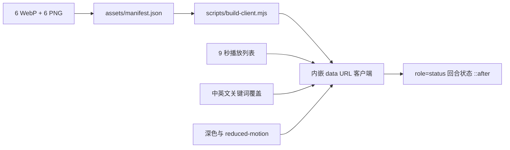

<p align="center">
  
</p>

<p align="center">
  <a href="https://awesome.re"></a>
  <a href="https://awesome-dsh-plugin.com"></a>
  <a href="LICENSE"></a>
  
  
  
</p>

<p align="center">
  <strong>为 DeepSeek Harness Web 回合状态提供六套原创鲸鱼动画和一个轻量动画导演。</strong><br />
  自动轮换、状态关键词覆盖、深色主题适配、运行时零网络请求，并为每套动画提供静态回退。
</p>

<p align="center">
  <a href="README.md">English</a> · 简体中文
</p>

## 动画预览

<p align="center">
  
</p>

v0.4.0 不再只播放一段固定的下潜 WebP。当前 Harness 在运行回合中通常持续显示同一个 `Deep diving...` 文案，因此插件会每 **9 秒**按 `dive → sonar → work → compose → idle` 自动轮换；当未来版本或定制界面出现“搜索、执行工具、生成回答、等待、错误”等可识别文案时，关键词状态会立即覆盖定时播放列表。

## 六种状态

<p align="center">
  
</p>

| 状态 | 动画表现 | 触发逻辑 |
|---|---|---|
| **Deep Dive** | 破水、翻滚、重新下潜 | 自动播放列表；思考、推理、分析、规划 |
| **Sonar** | 从吻部向前传播的声呐波 | 自动播放列表；搜索、检索、浏览、调研 |
| **Tool Run** | 高频摆尾、速度线和工作粒子 | 自动播放列表；工具、执行、命令、构建、测试 |
| **Stream** | 类 Token 粒子连续流出 | 自动播放列表；生成、撰写、回答、流式输出 |
| **Calm** | 低幅呼吸和气泡上浮 | 自动播放列表；等待、排队、暂停 |
| **Retry** | 轻微摆动和注意提示 | 仅错误、失败、异常、重试关键词 |

英文和中文关键词均已内置。普通 `Deep diving...` 文案故意不被识别为显式状态，以便当前版本仍能完整展示五状态播放列表。

## 核心特性

| | 特性 | 说明 |
|---|---|---|
| 🐋 | **六套原创逐帧动画** | 每套 352 × 352、48 帧、40 ms/帧，单循环 1.92 秒。 |
| 🎬 | **双轨动画导演** | 当前固定文案使用定时播放列表；未来状态文案使用关键词即时覆盖。 |
| ♿ | **逐状态减少动态效果** | `prefers-reduced-motion` 下停止轮换，并为当前状态使用对应 PNG 静态帧。 |
| 🌗 | **主题和屏幕适配** | 系统深色、`html.dark`、`data-theme="dark"` 自动反色；尺寸按 84 / 72 / 60 px 响应式收缩。 |
| 📦 | **完全自包含** | 6 个 WebP 和 6 个 PNG 由构建脚本嵌入 `lib/client.js`，安装后不访问外部 URL。 |
| 🧩 | **更稳健的挂载点** | 组合使用 `role="status"` 和 `_turnStatus` 类名后备，不再只依赖单个哈希类名。 |
| 🫧 | **降低样式侵入** | 只使用目标状态元素的 `::after`，不再清空 `::before`，不改状态文案和交互。 |
| ♻️ | **幂等且可清理** | 重复激活会先清理旧实例；卸载时移除样式、定时器、观察器和插件属性。 |
| 🔒 | **严格纯视觉范围** | 无设置账号、无模型工具、无持久化、无工作区读取、无用户内容处理。 |

## 安装

安装最新发布版到 DSH Web profile：

```powershell
dsh plugin --profile web add github:LeemanCheung/dsh-whale-animation#v0.4.0
```

跟随主分支：

```powershell
dsh plugin --profile web add github:LeemanCheung/dsh-whale-animation
```

安装后硬刷新 DSH Web 页面；若当前 profile 已缓存客户端 Bundle，请重启 DSH。

### 升级

```powershell
dsh plugin --profile web remove dsh-whale-animation
dsh plugin --profile web add github:LeemanCheung/dsh-whale-animation#v0.4.0
```

### 卸载

```powershell
dsh plugin --profile web remove dsh-whale-animation
```

## 动画规格

| 属性 | 数值 |
|---|---:|
| 动画状态 | 6 套 |
| 自动播放状态 | 5 套 |
| 源画布 | 352 × 352 px |
| 每套帧数 | 48 |
| 单帧时长 | 40 ms |
| 单循环时长 | 1.920 秒 |
| 播放列表间隔 | 9 秒 |
| CSS 显示尺寸 | 84 / 72 / 60 px |
| 动态资源合计 | 1,206,950 bytes |
| 静态资源合计 | 54,957 bytes |
| 预构建客户端 | 约 1.69 MB |
| 运行时资源请求 | 0 |

## 工作原理



`lib/index.js` 仍然是刻意保持为空的 Host 入口；全部行为通过 `dsh.client` 在浏览器中运行。客户端使用 MutationObserver 处理 Harness 的局部重绘，每秒只执行一次轻量状态判断，逐帧播放由浏览器的动画 WebP 解码器完成。

当前目标节点是：

```css
.Md3f7G_turnStatus[role="status"],
[class*="_turnStatus"][role="status"]
```

插件会在目标元素上写入 `data-dsh-whale-host` 和 `data-dsh-whale-state`，再由 `::after` 显示对应动画。深色模式通过反色适配单色资产；减少动态效果模式使用相同状态的 PNG，并固定在默认状态或明确关键词状态。

## 开发与验证

要求：**Node.js 20+**。重新生成动画和文档资产需要 Python 3 与 Pillow：

```powershell
python -m pip install Pillow
npm run build:assets
npm run build
npm run check
```

常用命令：

| 命令 | 作用 |
|---|---|
| `npm run build:assets` | 生成 6 套 WebP、6 张 PNG、manifest、头图、预览和状态画廊 |
| `npm run build` | 将 manifest 中的全部资源嵌入 `lib/client.js` |
| `npm run check` | 校验动画结构、哈希、Bundle、状态导演、生命周期和 README 资产 |
| `npm run check:browser` | 在无头 Chromium 中挂载已提交 Bundle，并生成浅色/深色烟测截图 |
| `npm run verify` | 重建客户端并执行确定性的非浏览器检查 |

验证范围包括：

- 12 个资源文件的格式、大小和 SHA-256；
- 每个 WebP 的 48 帧、40 ms 帧时长和 1.92 秒循环；
- manifest 与客户端内嵌 data URL 完全一致；
- 五状态轮换、关键词覆盖、错误优先级、reduced-motion 固定；
- 样式安装、MutationObserver、定时器和 dispose 清理；
- README 头图、50 帧预览、状态画廊尺寸与本地链接；
- CI 中的预构建 Bundle 一致性、真实 Chromium 状态映射、浅色/深色截图和 `npm pack` 检查。

更完整的设计取舍与后续路线见 [`docs/ANIMATION_ROADMAP.zh-CN.md`](docs/ANIMATION_ROADMAP.zh-CN.md)。

## 仓库结构

```text
assets/
  manifest.json          动画清单、时序、文件大小与 SHA-256
  whale-*.webp           六套动画资源
  whale-*.png            六套 reduced-motion 静态帧
src/
  client-runtime.js      状态导演和浏览器生命周期源代码
lib/
  index.js               空 Host 入口
  client.js              预构建、内嵌全部资产的 DSH Web 客户端
scripts/
  build-whale-assets.py  生成动画与 README 视觉资产
  build-client.mjs       根据 manifest 构建浏览器客户端
  check.mjs              验证资源、Bundle 和运行时行为
  check-readme-assets.py 验证文档视觉资产和链接
  browser-smoke.html     覆盖六种状态的浏览器测试页面
  check-browser.sh       执行 Chromium 烟测并生成浅色/深色截图
docs/
  hero.png               README 头图
  preview.webp           五状态动画预览
  state-gallery.png      六状态静态画廊
  ANIMATION_ROADMAP.zh-CN.md 设计与后续路线
```

`lib/client.js` 会提交到仓库，确保 GitHub 安装无需在用户机器上执行构建，也不需要运行时下载动画文件。

## 兼容性与限制

- 仅面向 **DeepSeek Harness Web UI**，要求兼容 `@deepseek-ai/dsh-client-runtime ^0.1.0-rc.6` 的 DSH 版本。
- 当前 Shell 若重命名 `_turnStatus` 且移除 `role="status"`，需要更新选择器。
- 插件仍需占用目标元素的 `::after`；其他同时使用该伪元素的插件可能发生样式冲突。
- 定时播放列表是当前固定状态文案下的兼容方案，并不代表真实模型阶段。未来若 DSH 暴露稳定阶段事件，将优先改为事件驱动。
- 资源以内嵌方式换取零网络请求，因此 `lib/client.js` 约 1.69 MB。

## 声明

本项目为独立项目，与 DeepSeek 无关联，也未获得其背书。动画是为呼应 DeepSeek Harness 鲸鱼主题状态体验而制作的原创 UI 插图。视觉设计与商标说明请参阅 [NOTICE.md](NOTICE.md)。

## 许可证

以 [MIT License](LICENSE) 发布。版本变化见 [CHANGELOG.md](CHANGELOG.md)。
