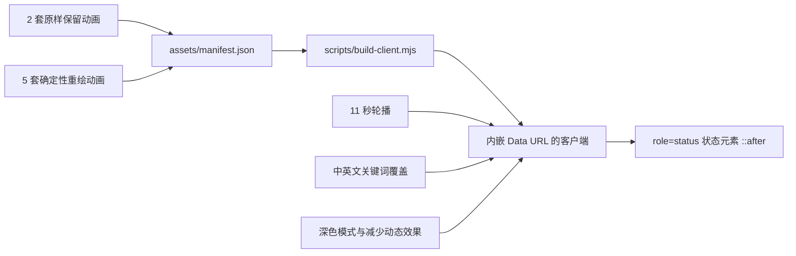

<p align="center">
  
</p>

<p align="center">
  <a href="https://awesome.re"></a>
  <a href="https://awesome-dsh-plugin.com"></a>
  <a href="LICENSE"></a>
  
  
  
  
</p>

<p align="center">
  <strong>两套用户原始鲸鱼动画逐字节保留；Work、Stream、Calm、Retry 按前两套动画的黑白水墨鲸鱼语言重新制作。</strong><br />
  支持定时轮播、关键词覆盖、深色模式、零运行时网络请求，以及每个状态独立的静态降级图。
</p>

<p align="center">
  <a href="README.md">English</a> · 简体中文
</p>

## 动态预览

<p align="center">
  
</p>

v0.5.0 纠正了 v0.4.0 的视觉方向。Sonar 保持现状，后四态不再沿用蓝色静态图标或通用鱼类轮廓；角色身体直接取自 Refined Dive 与 Classic 的不可变 alpha 轮廓。构建器重定时并重组真实的跃水、尾先 S 弧、水线悬浮、spy-hop、浪花和回弹帧，速度线、输出墨滴和提示线只作为独立语义层。

两套 v0.4 以前的用户动画保持原样：

- **Refined Dive**：直接从提交 `65e1205d1fbf4b01997e6dfc099103b0f9717e37` 恢复，继续作为默认状态。
- **Classic**：直接从首个发布提交 `95b06e3f0e6ea817d25858eb29f7064a233b3c65` 恢复。

CI 会重新计算这四个历史文件的 Git Blob SHA-1；任意一个字节发生变化，验证都会失败。

## 七种状态

<p align="center">
  
</p>

| 状态 | 来源 | 动作语言 | 触发逻辑 |
|---|---|---|---|
| **Refined Dive** | 原样保留 | v0.3 的优化跃出与下潜闭环，不重新编码 | 默认状态；轮播；思考、推理、分析、规划 |
| **Classic** | 原样保留 | 项目首发版本的鲸鱼动画，不重新编码 | 轮播；经典、原版等显式关键词 |
| **Sonar** | 重新绘制 | 缓慢游动，躯干波动与声呐环同步扩散 | 轮播；搜索、浏览、检索、调研 |
| **Tool Run** | 重新绘制 | 纯黑推进、全身行波与水墨速度线 | 轮播；工具、执行、命令、构建、测试 |
| **Stream** | 重新绘制 | 黑色鲸鱼上扬与克制墨滴弧线 | 轮播；撰写、生成、回答、输出、流式 |
| **Calm** | 重新绘制 | 水线下悬浮、长尾漂移、气泡与克制眨眼 | 轮播；等待、排队、暂停 |
| **Retry** | 重新绘制 | 纯黑紧凑 C 形回卷与三条提示线 | 仅错误、失败、异常和重试关键词 |

普通的 `Deep diving...` 文案仍然不被识别为某个显式状态，因此当前 Harness 界面可以每 **11 秒**依次轮播；该时长足以让 10.506 秒的 Classic 历史动画完整播放一次：

`dive → classic → sonar → work → compose → idle`

一旦界面出现可识别的中英文状态文案，关键词映射会立即覆盖轮播。

## 视觉规范

Work、Stream、Calm、Retry 直接使用 Dive/Classic 真实帧遮罩生成，而不是重新发明一只图标鲸鱼；Sonar 保持已有生成样式。后四态强制满足：

- 可见像素只使用黑白，画布为真实透明 RGBA，禁止蓝色图标；
- 不绘制背鳍，不出现鲨鱼或普通鱼类轮廓；
- 精确保留历史帧里的紧凑头部、快速收窄躯干、长弧尾柄、宽阔尾鳍和负空间细节；
- 使用真实全身跃水、翻转、下潜、悬浮、S 形、spy-hop、浪花和回弹姿态，而不是移动横向胶囊；
- 往返子序列使用余弦重定时，使反转点速度归零且没有硬切；
- 声呐、粒子和提示线只作为辅助，不抢夺鲸鱼主体视觉。

两套历史状态不会经过生成器重新绘制、压缩或统一风格，它们以原始二进制文件继续存在于轮播和发布包中。

## 核心特性

| | 特性 | 说明 |
|---|---|---|
| 🐋 | **两套原动画完整保留** | 历史 WebP 与 PNG 使用稳定路径恢复，并在 CI 中逐字节验证。 |
| 🌊 | **四套历史轮廓重做** | Tool Run、Calm 派生自 Dive；Stream、Retry 派生自 Classic；Sonar 保持不变。 |
| 🎬 | **双轨动画导演** | 当前固定状态文案走定时轮播；未来或定制文案走关键词即时覆盖。 |
| ♿ | **逐状态减少动态效果** | 开启 `prefers-reduced-motion` 后停止轮播，并使用对应 PNG。 |
| 🌗 | **适配主题与视口** | 支持系统深色模式、`html.dark`、`data-theme="dark"`，显示尺寸为 84 / 72 / 60 px。 |
| 📦 | **运行时完全自包含** | 全部 WebP 和 PNG 内嵌到 `lib/client.js`，激活后不发起外部请求。 |
| 🧩 | **更稳健的挂载选择器** | 同时使用 `role="status"` 语义定位与 `_turnStatus` 类名后备。 |
| 🫧 | **低样式侵入** | 仅占用状态元素的 `::after`，不修改原始文案，也不清除 `::before`。 |
| ♻️ | **生命周期完整清理** | 重复激活会移除旧实例；卸载时清除样式、定时器、观察器、监听器和属性。 |
| 🔒 | **严格视觉权限边界** | 不读取账户、工具、存储、工作区或用户内容，不联网。 |

## 安装

安装 v0.5.0：

```powershell
dsh plugin --profile web add github:LeemanCheung/dsh-whale-animation#v0.5.0
```

跟随 `main` 分支：

```powershell
dsh plugin --profile web add github:LeemanCheung/dsh-whale-animation
```

安装后对 DSH Web 执行强制刷新。如果当前 Profile 已缓存客户端 Bundle，请重启 DSH。

### 升级

```powershell
dsh plugin --profile web remove dsh-whale-animation
dsh plugin --profile web add github:LeemanCheung/dsh-whale-animation#v0.5.0
```

### 卸载

```powershell
dsh plugin --profile web remove dsh-whale-animation
```

## 动画规格

| 项目 | 数值 |
|---|---:|
| 总状态数 | 7 |
| 原样保留状态 | 2 |
| 重新生成状态 | 5 |
| 自动轮播状态 | 6 |
| 生成状态画布 | 352 × 352 px |
| 历史状态原生画布 | Refined Dive 352 × 352；Classic 184 × 184 |
| 重绘状态帧率 | 48 帧 × 40 ms |
| 重绘状态闭环时长 | 1.920 秒 |
| 历史状态时序 | 完整沿用原文件 |
| 状态轮播间隔 | 11 秒 |
| CSS 显示尺寸 | 84 / 72 / 60 px |
| 运行时资源请求 | 0 |

## 工作原理



`lib/index.js` 仍然是有意保持空操作的 Host 入口，全部行为通过 `dsh.client` 在浏览器端执行。`MutationObserver` 用于处理 Harness 子树替换，一秒定时器只负责状态选择，逐帧播放由浏览器原生 WebP 解码器完成。

目标选择器为：

```css
.Md3f7G_turnStatus[role="status"],
[class*="_turnStatus"][role="status"]
```

客户端会给状态元素写入 `data-dsh-whale-host` 和 `data-dsh-whale-state`，CSS 再通过 `::after` 绘制对应资源。减少动态效果模式下会选择对应 PNG，并冻结在默认状态或关键词显式状态。

## 开发与验证

需要 **Node.js 20+**、Python 3 和 Pillow：

```powershell
python -m pip install -r requirements.txt
npm run verify
npm run check:browser
```

| 命令 | 作用 |
|---|---|
| `npm run build:assets` | 保持两套历史资源不变，生成五套 WebP、五套 PNG、manifest、头图、预览和画廊 |
| `npm run build:runtime-assets` | 仅重建运行时动画与 manifest；不依赖系统字体，供 CI/Release 使用 |
| `npm run build` | 根据 manifest 把全部资源内嵌到 `lib/client.js` |
| `npm run build:motion-audit` | 写入确定性的 12 帧接触表与运动证据报告 |
| `npm run build:style-audit` | 写入 84/60 px 原尺寸 Dive/Classic 身份对照与色彩证据 |
| `npm run audit:motion` | 重新计算可见帧多样性与连续性，并拒绝过期或不合格证据 |
| `npm run audit:style` | 拒绝蓝色/彩色像素、非透明背景、复杂内部纹理和不可辨认轮廓 |
| `npm run check` | 验证历史 Git Blob、生成时序、Bundle、动画导演、生命周期和文档资源 |
| `npm run check:browser` | 在无头 Chromium 中挂载七种状态，并生成浅色/深色截图 |
| `npm run verify` | 重建资产和客户端，再执行确定性非浏览器测试 |

验证范围包括：

- 两套历史 WebP 和两套历史 PNG 的 Git Blob SHA-1；
- 五套重绘状态的 48 帧、40 ms 帧时长和 1.92 秒闭环；
- 后四态的真实 RGBA 透明、纯黑可见像素、极简内部细节，以及 60/84 px 轮廓可辨识度；
- 文件体积、SHA-256、manifest 与内嵌 Data URL 的一致性；
- 两套历史状态在轮播中的保留、中英文关键词覆盖、错误优先级与减少动态效果冻结；
- 样式安装、`MutationObserver`、定时器释放及宿主属性清理；
- README 头图、动态预览、状态画廊尺寸和本地链接；
- CI 中的真实 Chromium 状态识别、浅色/深色截图和 `npm pack --dry-run`。

### 运动连续性证据

<p align="center">
  
</p>

上图按运行时真实速度播放后四态：48 帧 × 40 ms，形成 1.92 秒无缝循环；它与 README 中为快速浏览而抽帧的多状态预览相互独立。[`docs/rebuilt-states-real-speed.json`](docs/rebuilt-states-real-speed.json) 锁定预览 SHA-256 与四个源动画哈希，CI 会拒绝过期画面。

<p align="center">
  
</p>

[`docs/motion-audit.json`](docs/motion-audit.json) 会在 alpha 归一化后记录可见帧数量、冻结步比例、绝对变化、前景归一化变化、运动前景覆盖率、alpha 轮廓质心与预乘 RGBA 外观质心、抽样帧哈希和循环接缝。普通生成素材继续使用 4 px 质心上限；四个显式带 `derivedFrom` 的状态保留历史动画有意的全身位移，因此单独记录 24 px 上限，同时继续执行相同的步长比例、绝对变化、前景变化、覆盖率与接缝门禁。Calm 与 Retry 有意沿原姿态倒序回弹（分别 25/48、26/48 个唯一可见帧），但相邻冻结比例均为 0，中位运动前景覆盖率为 0.67–0.68，循环接缝均低于普通步长的 0.20 倍。

### 60/84 px 身份证据

<p align="center">
  
</p>

[`docs/style-identity-audit.json`](docs/style-identity-audit.json) 会同时验证后四态动画帧与降级 PNG 的真实透明、零蓝色/零彩色可见像素、有限内部亮色细节、静态帧映射一致，以及两个尺寸下足够完整的连通鲸鱼轮廓。接触表展示的是运行时原尺寸，而不是放大的裁剪图。图像生成姿态研究、哈希、alpha 实测与被否决方向记录在 [`docs/animation-lineage.json`](docs/animation-lineage.json)；白底 RGB 姿态研究只提供动作灵感，不承担 accepted body identity。

动画设计依据和后续路线记录在 [`docs/ANIMATION_ROADMAP.zh-CN.md`](docs/ANIMATION_ROADMAP.zh-CN.md)。

## 仓库结构

```text
assets/
  whale-dive.webp/.png      从 v0.3 原样保留的优化动画
  whale-classic.webp/.png   从首发提交原样保留的经典动画
  whale-sonar.webp/.png     重绘生成状态
  whale-work.webp/.png      重绘生成状态
  whale-compose.webp/.png   重绘生成状态
  whale-idle.webp/.png      重绘生成状态
  whale-alert.webp/.png     重绘生成状态
  whale-static.png          兼容 v0.4 以前消费者的静态别名
  manifest.json             来源、时序、体积、提交和 SHA-256
src/
  client-runtime.js         动画导演和浏览器生命周期源码
lib/
  index.js                  空操作 Host 入口
  client.js                 内嵌全部资源的预构建 DSH Web 客户端
scripts/
  whale_assets/model.py     Sonar 模型与共享图像/构建基础能力
  whale_assets/states.py    历史元数据与真实帧派生状态渲染器
  build-whale-assets.py     生成重绘资源和 README 视觉资产
  build-client.mjs          根据 manifest 构建浏览器客户端
  check.mjs                 验证资源、Bundle 和运行时行为
  check-readme-assets.py    验证文档视觉、链接和历史 Blob
  check-whale-style.py      验证纯黑水墨色彩与 60/84 px 身份证据
  audit-motion.py           验证可见帧多样性与循环连续性
  browser-smoke.html        覆盖七种状态的浏览器测试页面
  check-browser.sh          执行 Chromium 烟测和浅色/深色截图
docs/
  hero.png                  README 头图
  preview.webp              六状态轮播预览
  state-gallery.png         七状态静态画廊
  rebuilt-states-real-speed.webp  后四态真实 40 ms 帧速预览
  rebuilt-states-real-speed.json  预览哈希与四个当前源动画哈希
  motion-contact-sheet.png  每种状态 12 个抽样帧
  motion-audit.json         可机器读取的连续性证据
  style-identity-contact-sheet.png  原尺寸 Dive/Classic 身份对照
  style-identity-audit.json 可机器读取的色彩与轮廓证据
  animation-lineage.json    图像生成提示词、哈希、alpha 事实与否决记录
  ANIMATION_ROADMAP.zh-CN.md 动画设计依据和路线图
```

`lib/client.js` 有意提交到仓库，因此通过 GitHub 安装时无需本地构建，也无需运行时下载动画资源。

## 兼容性与限制

- 面向 **DeepSeek Harness Web UI**，要求 DSH 版本兼容 `@deepseek-ai/dsh-client-runtime ^0.1.0-rc.6`。
- 如果 Shell 同时移除 `_turnStatus` 和 `role="status"`，需要更新选择器。
- 插件占用目标元素的 `::after`，其他插件若使用同一伪元素可能发生冲突。
- 定时轮播是适配当前固定状态文案的兼容方案，不代表模型真实执行阶段。
- 为确保用户制作的两套原动画继续可用，首发大体积动画也被内嵌，因此客户端体积会高于 v0.4.0。

## 归属说明

本项目为独立项目，与 DeepSeek 无隶属或官方背书关系。重绘动画是围绕鲸鱼主题视觉语言创作的原创 UI 插画，并非复制官方素材。视觉设计与商标说明参见 [NOTICE.md](NOTICE.md)。

## 许可证

项目采用 [MIT License](LICENSE)。版本历史见 [CHANGELOG.md](CHANGELOG.md)。
