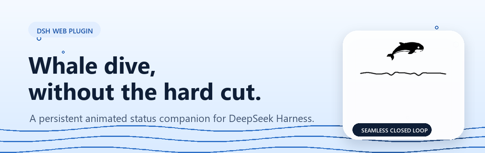
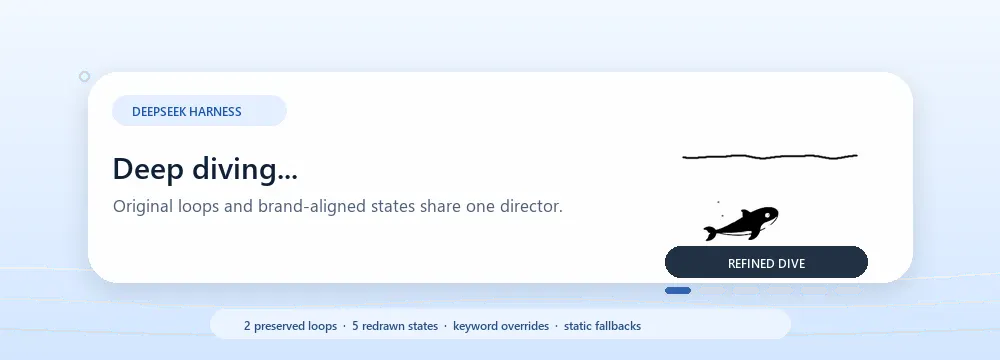
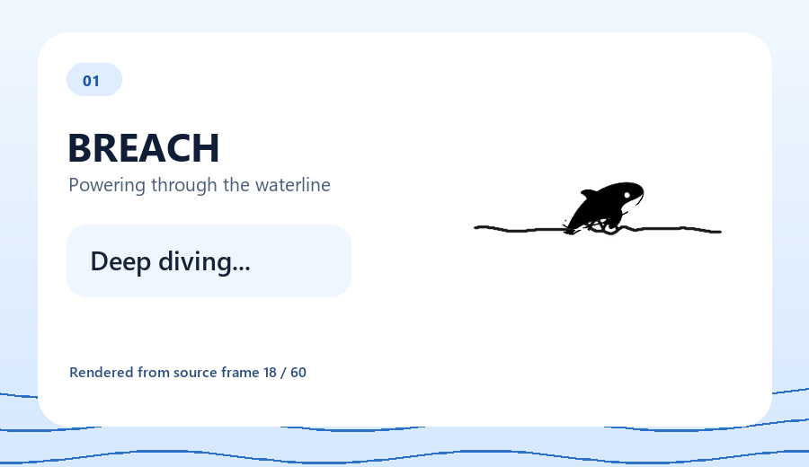
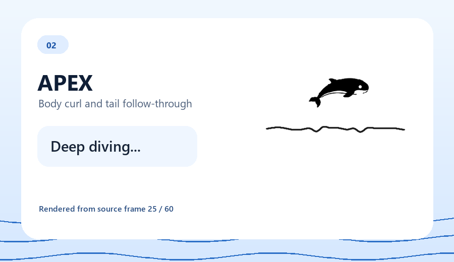
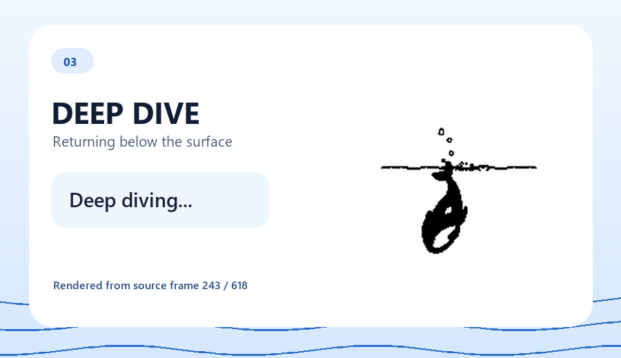
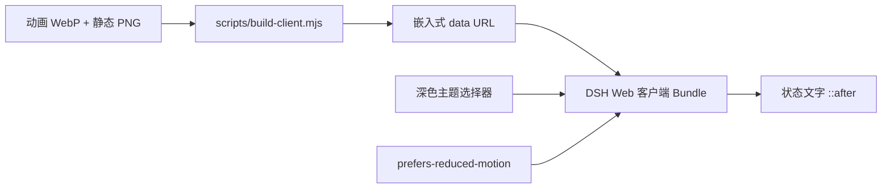

<p align="center">
  
</p>

<p align="center">
  <a href="https://awesome.re"></a>
  <a href="https://awesome-dsh-plugin.com"></a>
  <a href="LICENSE"></a>
  
  
  
</p>

<p align="center">
  <strong>在 DeepSeek Harness 状态文字旁显示持久化、随主题适配的单色鲸鱼深潜动画。</strong><br />
  无缝闭环、运行时零网络请求，并为减少动态效果用户提供静态回退。
</p>

<p align="center">
  <a href="README.md">English</a> · 简体中文
</p>

## 动画预览

<p align="center">
  
</p>

> 预览包含 60 帧、每帧 33 ms 的正式播放节奏；不会额外插入过渡帧。v0.3.0 使用紧凑头型、上扬吻部、眼睛、嘴部和短尾鳍，同时保持躯干与尾部逐帧弯曲。

## 截图

<table>
  <tr>
    <td width="33%"></td>
    <td width="33%"></td>
    <td width="33%"></td>
  </tr>
  <tr>
    <td align="center"><strong>01 — 破水跃起</strong></td>
    <td align="center"><strong>02 — 跃起顶点</strong></td>
    <td align="center"><strong>03 — 入水深潜</strong></td>
  </tr>
</table>

所有截图均直接从仓库中的 `assets/whale-dive.webp` 渲染，因此展示的是用户实际安装后收到的动画帧，而不是单独绘制的概念图。头图、预览和截图在两份 README 中共用带英文文案的生成资产，以保证只有一套可复现的视觉产物；周边说明与替代文本已本地化。

## 特性

| | 特性 | 说明 |
|---|---|---|
| 🌊 | **传播式水面** | 破水和入水会产生传播、回弹并逐步衰减的波峰，水线不再静止。 |
| 🐋 | **原创的关节化鲸鱼** | 紧凑头型、上扬吻部、眼睛、嘴部和短尾鳍保持清晰，躯干与尾部在循环中弯曲。 |
| 🌗 | **随主题适配** | 浅色模式使用正常单色图形；`prefers-color-scheme: dark`、`html.dark` 和 `html[data-theme="dark"]` 下自动反色。 |
| 📦 | **自包含 Bundle** | 动态 WebP 与静态 PNG 已嵌入客户端，无需运行时 URL 或原始帧目录。 |
| ♿ | **支持减少动态效果** | 检测到 `prefers-reduced-motion` 时自动切换为静态 PNG。 |
| ⚙️ | **零配置** | 尺寸、偏移、选择器和动画资源均在构建时固定；自定义需要重新构建 `lib/client.js`。 |
| 🎯 | **严格的纯视觉范围** | 只装饰 Web 回合状态区域；没有设置项、模型工具、持久化存储、工作区访问、网络请求或用户内容处理。 |
| ♻️ | **生命周期可清理且幂等** | 激活时先移除旧的插件样式，再由 Cordis Client fiber 挂载一个新样式；停止或卸载时完整移除。 |
| 🔌 | **Web profile 挂载声明** | `dsh.bundle` manifest 与 `cordis.patch.yml` 声明浏览器客户端应在 DSH 加载 bundle 时自动挂载到 Web profile。 |

## 安装

从 GitHub 直接安装到 DSH Web profile：

```powershell
dsh plugin --profile web add github:LeemanCheung/dsh-whale-animation
```

安装后请硬刷新 DSH Web 页面。如果当前 profile 已缓存客户端 Bundle，请重启 DSH。

如需固定当前版本，可使用 `#v0.3.0`：

```powershell
dsh plugin --profile web add github:LeemanCheung/dsh-whale-animation#v0.3.0
```

### 卸载

```powershell
dsh plugin --profile web remove dsh-whale-animation
```

## 动画规格

| 属性 | 数值 |
|---|---:|
| 源画布 | 352 × 352 px（CSS 显示为 84 × 84 px） |
| 动画帧数 | 60 |
| 单帧时长 | 33 ms |
| 循环时长 | 1.980 秒 |
| 编码 | 动画 RIFF WebP |
| 减少动态效果资源 | PNG |
| 运行时资源请求 | 无 |

`npm run check` 会验证客户端注册与清理、RIFF/WebP 帧结构、60 × 33 ms 的动画时序、内嵌 WebP/PNG data URL、84 px 布局规则与深色主题 CSS 规则。它不对美术连续性打分，也不证明源素材画面唯一。

`python scripts/check-readme-assets.py` 会独立验证 1200 × 380 头图、1000 × 320 且为 60 帧/1.980 秒的预览、三张 900 × 520 截图、预览文件大小预算、本地 README 链接，以及每份 README 恰有一个 Mermaid 图。

这些属于静态 bundle/资源校验。本次验证未在真实 DSH Web profile 中完成安装和激活，因此自动挂载与 GUI 实际渲染目前是基于 manifest/源码的行为说明，而非端到端证据。

## 工作原理



`lib/index.js` 是刻意保持为空的 Host 入口：全部行为都通过软件包的 `dsh.client` Web 注册在浏览器中运行。两个资源都以内嵌 data URL 形式写入 `lib/client.js`，因此安装后运行时不依赖仓库检出目录。

客户端会先移除已有的 `style[data-plugin="dsh-whale-animation"]`，再通过 `ctx.effect()` 添加一个样式，并在 dispose 时移除。CSS 同时匹配当前哈希化状态类和 `[class*="_turnStatus"]` 后备选择器，清空该元素的 `::before` 内容，并在其右侧 6 px 绘制不可交互的 84 × 84 px `::after`。该宽泛后备选择器及两个伪元素，可能与未来 Shell 改版或同一表面上的其他插件样式发生冲突。

深色主题选择器会反转单色素材；`prefers-reduced-motion` 会切换为 PNG。没有设置页或运行时配置——尺寸、偏移、选择器和素材都会生成到 `lib/client.js` 中。

## 开发

要求：**Node.js 20+**。只有重新生成 README 配图时才额外需要 Python 3、Pillow 和 NumPy：

```powershell
python -m pip install Pillow numpy
npm run build
npm run check
python scripts/build-readme-assets.py
python scripts/check-readme-assets.py
```

`npm run check` 只验证客户端 Bundle；配图和链接验证是独立的 Python 命令，发布文档前应如上同时执行。配图生成器优先使用 Windows 上的 Segoe UI 字体文件，缺失时会回退到 Pillow 默认字体，因此当前无法在非 Windows 平台保证字节级一致的重新生成结果。

### 仓库结构

```text
assets/
  whale-dive.webp        完整动画资源
  whale-static.png       减少动态效果静态回退
docs/
  hero.png               README 头图
  preview.webp           README 轻量动画预览
  screenshots/           破水、顶点与深潜动作截图
lib/
  index.js               刻意保持为空的 Host 入口
  client.js              预构建 DSH 浏览器客户端
scripts/
  build-client.mjs       将源资源嵌入客户端
  build-readme-assets.py 使用真实动画重新生成仓库配图
  check-readme-assets.py 验证配图时序、尺寸与 README 链接
  check.mjs              验证注册、生命周期与嵌入资源
cordis.patch.yml         持久化 DSH Bundle 组合补丁
```

`lib/client.js` 会有意提交到仓库，确保 GitHub 安装无需执行构建或下载外部资源。

## 兼容性

- 仅面向 **DeepSeek Harness Web UI**，并需要兼容 `@deepseek-ai/dsh-client-runtime ^0.1.0-rc.6` 的 DSH 版本。
- 使用当前哈希化状态类与 `[class*="_turnStatus"]` 后备选择器。Shell 的 DOM、类名或伪元素若重构，可能需要更新选择器；也会与同样占用目标元素 `::before` 或 `::after` 的插件冲突。
- 浅色、系统深色、`html.dark` 与 `html[data-theme="dark"]` 均通过 CSS 反色适配；减少动态效果使用静态 PNG。插件没有运行时设置，84 px 尺寸和右侧偏移为构建时常量。

## 声明

本项目为独立项目，与 DeepSeek 无关联，也未获得其背书。动画是为呼应 DeepSeek Harness 鲸鱼主题状态体验而制作的原创 UI 插图。视觉设计与商标说明请参阅 [NOTICE.md](NOTICE.md)。

## 许可证

以 [MIT License](LICENSE) 发布。
