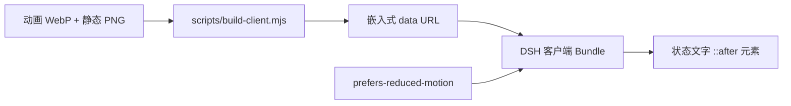

<p align="center">
  
</p>

<p align="center">
  <a href="https://awesome.re"></a>
  <a href="https://awesome-dsh-plugin.com"></a>
  <a href="LICENSE"></a>
  
  
  
</p>

<p align="center">
  <strong>在 DeepSeek Harness 状态文字旁显示持久化黑色鲸鱼深潜动画。</strong><br />
  无缝闭环、运行时零网络请求，并为减少动态效果用户提供静态回退。
</p>

<p align="center">
  <a href="README.md">English</a> · 简体中文
</p>

## 动画预览

<p align="center">
  
</p>

> 为减小仓库页面负担，预览图每隔一帧采样一次；插件实际携带完整的 **618 帧**无损动画。

## 特性

| | 特性 | 说明 |
|---|---|---|
| 🌊 | **无缝闭环** | 往返闭环轨迹避免末帧切回首帧时出现明显跳变。 |
| 🐋 | **清晰的黑色鲸鱼** | 单色鲸鱼轮廓在紧凑的状态文字旁仍保持清晰可辨。 |
| 📦 | **自包含 Bundle** | 动态 WebP 与静态 PNG 已嵌入客户端，无需运行时 URL 或原始帧目录。 |
| ♿ | **支持减少动态效果** | 检测到 `prefers-reduced-motion` 时自动切换为静态 PNG。 |
| 🔌 | **持久化 DSH 插件** | `dsh.bundle` manifest 与 `cordis.patch.yml` 会在 Web profile 中自动挂载客户端。 |

## 安装

从 GitHub 直接安装到 DSH Web profile：

```powershell
dsh plugin --profile web add github:LeemanCheung/dsh-whale-animation
```

安装后请硬刷新 DSH Web 页面。如果当前 profile 已缓存客户端 Bundle，请重启 DSH。

### 卸载

```powershell
dsh plugin --profile web remove dsh-whale-animation
```

## 动画规格

| 属性 | 数值 |
|---|---:|
| 画布 | 184 × 184 px |
| 原始帧数 | 618 |
| 单帧时长 | 17 ms |
| 循环时长 | 10.506 秒 |
| 编码 | 带 Alpha 的无损动画 WebP |
| 减少动态效果资源 | 透明 PNG |
| 运行时资源请求 | 无 |

项目会对最终编码后的 WebP 进行实际解码验证，而不只是检查源帧。当前闭环接缝的 Alpha 差异为 `0.01858`；在项目的 60 Hz 采样检查中，17 ms 帧节奏不会跳过源帧。

## 工作原理



客户端向 DSH 状态文字元素添加一个归属于插件生命周期的样式表。两个资源都以内嵌 data URL 形式写入 `lib/client.js`，因此安装后运行时不依赖仓库检出目录。

## 开发

要求：**Node.js 20+**。只有重新生成 README 配图时才需要 Python 与 Pillow。

```powershell
node scripts/build-client.mjs
node scripts/check.mjs
python scripts/build-readme-assets.py
python scripts/check-readme-assets.py
```

### 仓库结构

```text
assets/
  whale-dive.webp        完整无损动画
  whale-static.png       减少动态效果静态回退
docs/
  hero.png               README 头图
  preview.webp           README 轻量动画预览
lib/
  client.js              预构建 DSH 浏览器客户端
scripts/
  build-client.mjs       将源资源嵌入客户端
  build-readme-assets.py 使用真实动画重新生成仓库配图
  check-readme-assets.py 验证配图时序、尺寸与 README 链接
  check.mjs              验证注册、生命周期与嵌入资源
cordis.patch.yml         持久化 DSH Bundle 组合补丁
```

`lib/client.js` 会有意提交到仓库，确保 GitHub 安装无需执行构建或下载外部资源。

## 兼容性

- 目标平台为 **DeepSeek Harness Web UI**。
- 需要兼容 `@deepseek-ai/dsh-client-runtime ^0.1.0-rc.6` 的 DSH 版本。
- 当前依赖 DSH 状态文字的 CSS 类名模式；未来 DSH Shell 若重新设计，可能需要更新选择器。

## 声明

本项目为独立项目，与 DeepSeek 无关联，也未获得其背书。动画是为呼应 DeepSeek Harness 鲸鱼主题状态体验而制作的原创 UI 插图。视觉设计与商标说明请参阅 [NOTICE.md](NOTICE.md)。

## 许可证

以 [MIT License](LICENSE) 发布。
