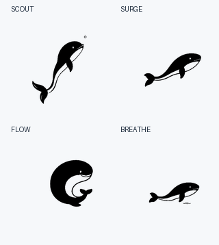

# dsh-whale-animation

在 DeepSeek Harness Web 的任务状态旁播放黑白鲸鱼动画。**v0.8.0 保留原有 Dive、Classic，新增探泡、疾游、回旋、吐息四个生图动作。**



预览GIF为20fps，四个动作保持各自真实速度；插件使用60fps的原生WebP。探泡采用自然往返，回旋保持小幅C形收放，不将整张logo僵硬旋转。

| 动作 | 场景 | 画面 |
| --- | --- | --- |
| Dive／Classic | 原始默认动画 | 原文件和时序逐字节保留 |
| 探泡 Scout | 搜索、检索、读取 | 跟随气泡，身体与尾部自然往返 |
| 疾游 Surge | 运行、执行、测试 | 躯干轻微S形发力，尾鳍跟随 |
| 回旋 Flow | 编写、输出 | C形躯干收放，腹部与尾部协同变化 |
| 吐息 Breathe | 等待、连接、重试 | 拱背吐息，落下水滴后放松 |

## 保留与行为

- 原有两个WebP、两个减少动画PNG及兼容静帧均有固定哈希校验，绝不重新编码。
- 新动作每组8张ImageGen原画，共32张；播放帧包含明确记录的补帧，不能视为新原画数量。
- 探泡144帧/2.4秒，疾游120帧/2秒，回旋180帧/3秒，吐息216帧/3.6秒。探泡往返会重新经过相同姿态，不虚报144张独立原画。
- 未识别状态按六个动作轮播；切换时先播完当前循环。状态文字匹配仅选择画面，不证明工具完成、任务成功或其他业务结果。
- 84/72/60px响应尺寸、深浅主题、减少动画PNG、后台暂停和卸载清理均保留。素材准备异常时静态回退。
- 所有美术离线内嵌，无SVG鲸鱼、外部图片请求或额外模型调用。插件不改变字体、模型、权限、会话或养成数据。

## 安装

```powershell
dsh plugin --profile web add github:LeemanCheung/dsh-whale-animation
```

已有用户环境请在安全时机加载更新；本轮开发验证使用隔离DSH，不自动重启日常服务。

## 开发与验证

```powershell
npm run verify
npm run check:package
npm run check:browser
```

Git源码包含原图、提示词和来源记录。需要重建或核验生图资产时：

```powershell
python -m pip install -r requirements-art.txt
npm run art:check
```

安装了Python Playwright和Chrome的开发机可运行 `npm run check:playback`。真实浏览器检查与来源说明见[四动作记录](docs/four-actions/README.md)和[兼容记录](COMPATIBILITY.md)。

运行安装包不重复携带生成原图，原图保留在GitHub源码；`art:check`需在完整Git检出目录运行。项目独立开发，不是DeepSeek官方logo或官方动画。详见[NOTICE](NOTICE.md)。

[English](README.md) · 简体中文
