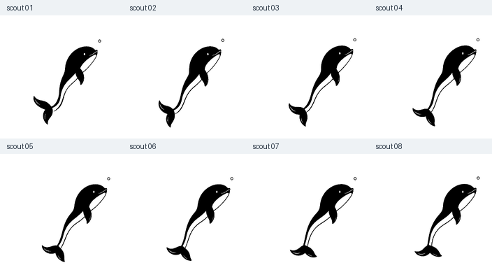
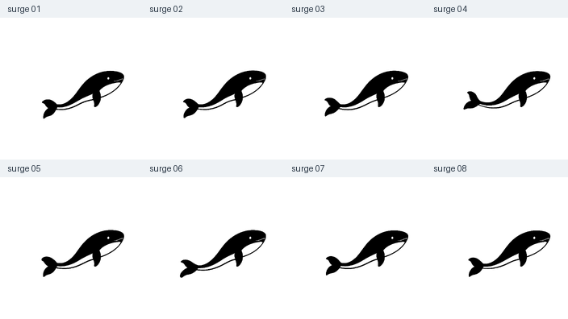
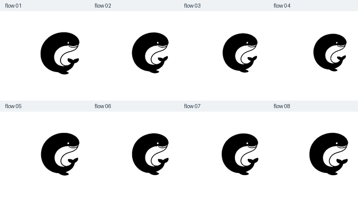
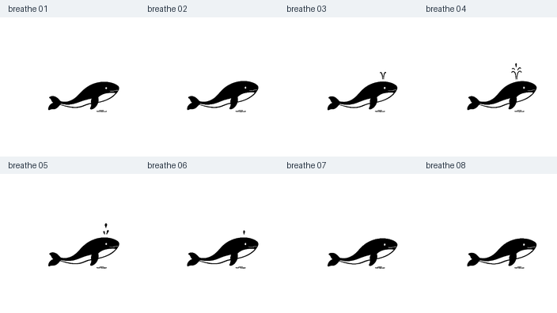

# Four ImageGen actions · v0.8.0

## What changed

The original Dive and Classic WebP/PNG bytes and encoded timing are unchanged. Four additional monochrome raster actions are added, inspired by the familiar rounded forehead, alert eye, pale belly crescent and expressive tail, without using an official DeepSeek logo asset.

| State | Chinese name | Generated drawings | Playback frames | Duration |
| --- | --- | ---: | ---: | ---: |
| scout | 探泡 | 8 | 144 | 2.4s |
| surge | 疾游 | 8 | 120 | 2.0s |
| flow | 回旋 | 8 | 180 | 3.0s |
| breathe | 吐息 | 8 | 216 | 3.6s |

All four use 60fps encoded timing (16/17ms). Playback frames are not additional generated drawings. Scout follows its poses outward and back:14 native-pose placements and130 in-betweens; it intentionally revisits73 distinct images across144 frames, with no identical adjacent frames. The other three use8 native-pose placements each. Hardware/browser scheduling still determines the actual displayed frame rate.

## Art and continuity

- Every identity and key-pose sheet came from the built-in ImageGen tool. The full selected prompts and PNG originals are in `artwork-sources/four-actions` in the Git repository.
- The first12-pose families were rejected after real playback showed excessive posture changes and tail ghosts. Large global mesh warps and unregistered shape blending were also rejected, not shipped.
- Selected eight-pose families use restrained, coherent body movement. The user explicitly authorized background extraction, cropping, registration and in-between processing.
- One uniform scale per sheet and the source eye position determine registration. Breathe registers its generated water ripple. Black source paint is normalized to solid ink; white belly and eye are negative space.
- In-betweens use paired optical flow between nearby drawings. Scout returns through adjacent poses instead of jumping from its final tail orientation to the start.
- The torso motion is visible in the original drawings, not produced solely by moving a static logo. Flow is a small C-shaped coil/relax motion, not a full somersault.






## Reproduce and check

Use a Git checkout, Python3.12 and the pinned `requirements-art.txt` dependencies:

```text
python -m pip install -r requirements-art.txt
npm run art:check
npm run verify
npm run check:package
npm run check:playback
```

`art:check` reconstructs into ignored `.artifacts`, checks source hashes, exact shipped hashes, decoded pixels (maximum one intensity level for platform rounding), native-pose coverage, timing and transparent margins. `verify` regenerates the manifest and client without re-encoding any original animation. Raw generated PNG sheets stay in Git, not in the runtime npm archive; the archive includes lightweight source records and selected runtime assets.

Inspect `scripts/art-preview.html` for enlarged and actual-size native playback; `scripts/browser-smoke.html` exercises the actual built client with synthetic DSH-shaped status elements. These synthetic statuses are not provider-backed task execution.

No SVG, external asset URLs, model requests, timers per animation frame, user settings changes or progress-data migration are added.
